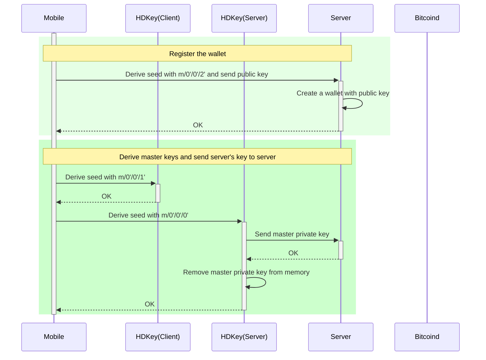
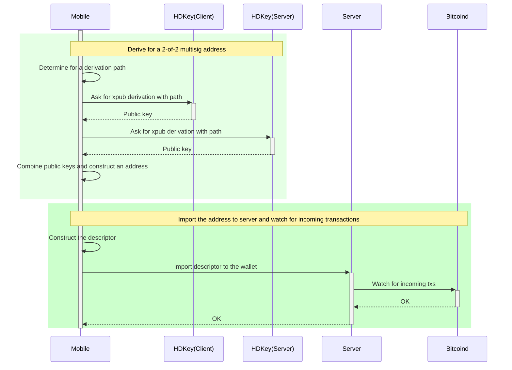
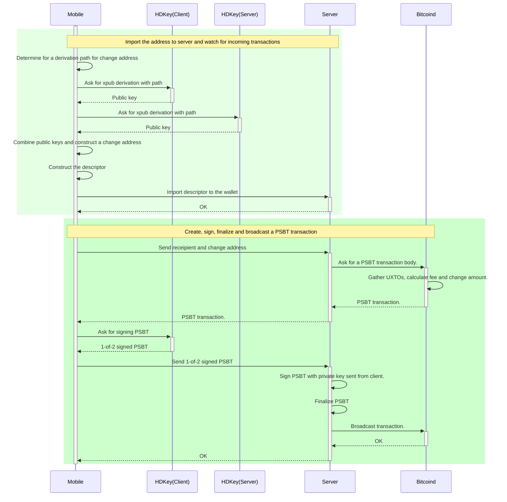

# **Autonomy Minimum Viable Architecture (MVA)**

:::spoiler {state=open} CONTENTS
[TOC]
:::
## Milestones

### Release v1.0 (2-MAR 2021)
- App
    - iOS (iPhone only)
- Server (partially isolated user processes)
    - Transaction Coordinator
    - Access Recovery
    - Contact list

Missing and bottlenecks
- TBD

### Release v1.5 (Q2 2021)
- App
    - Android
- Server
    - Policy Coordinator
    - Account policies
    - Transaction scheduling

### Release v2.0 (Q4 2021)
- App
    - TBD
- Server
    - Automated trading
    - Custom policies
    - TorGap messaging

## Keys

### Overview

* bitcoin keypairs
    * platform cosigner keypair
        * device keeps private key
    * recovery cosigner keypair
        * private key is sharded across at least
            * platform store
            * Bitmark store
            * contact store
    * gordian cosigner keypair
        * generated and kept in the container
* identitity keypair
    * created on device
    * sharded like recovery key
    * generate: Bitmark Customer account identifier
    * generate: messaging identifier(s)
    * generate: Tor keypair and certificate

### Reconstruction

* APP - reload from:
    * platform store
* Container - rebuild from:
    * encrypted store containing:
        * gordian co-signer keypair
        * wallet file(s) (rebuild this from keypair+account maps if `wallet.dat` damaged)
        * list of account maps
        * backup of contact list

### Recovery

* only necessary if:
    * platform store lost
    * container store lost
    * reason to suspect a key was leaked (e.g., stolen device)
* need to get back two shards to rebuild recovery keypair
* then use the remaining key platform or gordian to sweeep the funds to a new wallet
* extra second protection is to add an additional key wit on year time lock
    * if recovery key is used then the case of bot platform and container store lost is covered if sufficient shards are recovered

## Connections to other services

* spotbit - current price information
* coinbase API - fee estimation
* coingecko - historical price
* OneSignal - generic push notications

## Postman Documentation

[API on Postman](<https://documenter.getpostman.com/view/59304/TVYGbxbg> "API on Postman")

## BACKLOG
* Android Java libwally @moskovich
    * some of the values end up going through strings
    * make sure that the strings are zeroed out
    * strings are variable size and need careful consideration
    * what for string copies
    * maybe 2 mandays of high-level Java expert
* messaging
    * currently - Bitmark-run central whisper message queue
    *
* 2of3 (keys and shards)
    * BTC 2of3
    * joint account A & B each are 2of3
    * shard of recovery/identity is 2of3 or 3of5 or 4of9
    * BTC 2of3 +1(timelock: one year) so the fund is single sig after one year. TRADEOFF: make recovery key as the +1(timelock)
    * fixed order: `multi(platform,recovery,gordian)` or use `sortedmulti`?`
* Ed25519
    * lots of compatibility problems
    * different encodings of priv/pub
    * different privatekey e.d. random, hash()
    * different signature encodings
    * [https://gist.github.com/gorazdko/5fbe819b80e780a1894086b5731bb32d](<https://gist.github.com/gorazdko/5fbe819b80e780a1894086b5731bb32d>)
    * [Ristretto](<https://ristretto.group/ristretto.html>) solves the multisig problem (solves bitmarkd 2 sig transfer). Can use Schnorr with this
* price information where is it from, how to validate
    * spotbit service
    * fee estimation service
* secure MVP
    * signal versus onion
    * minimum necessary understanding of Tor for container communication
    * what problems might Tor cause
* multisig transaction coordinator
    * need more understanding
    * Schnorr sig (0.22? Q3 perhaps) (0.21 regtest testnet?)
    * will this increase message sizes too much
* invoicing and purchase orders
* sweep to new addresses under my own control
    * not necessarily close the wallet
* fiat work on UX
* fees
    * fees e.g., one dollar tx with N! dollar fee
    * whathefee.io  fee estimator, but confusing, maybe 3x3 matrix. Better than fast/slow-low/high
    * fee replacement, could UX have *add more fee button*
* cpfp
    * unconfirmed balance
    * how to handle balance=0 e.g. unconfirmed balance in *change*

* **Diagram Fixes**
    * only delete device shards when backup is complete
    * balance>B or activity>A or elapsed>T ask for backup
    * how to reconstruct Bitmark relationship
        * currently via email
        * simple OTP
        * get back Bitmark Deck
        * need to have unencrypted contact info (perhaps only a name)
        * **need to check sequence diagram, possible update required**
* [application](<https://hackmd.io/BnNeWeaHRuKZGd5ywScbVw?view>)

## Block Diagrams

### Container

**Description**

The system consists of the following components:
* API handler - this handles the HTTPS interface from the APP and has a number of functions
    * Handle some functions directly such as calls to external APIs (e.g., transaction cost)
    * Proxy connections to user's container
    * E2EE messaging between applications
* Container manager this performs:
    * Initial container instantiation
    * Container update - new program version
    * Container compaction - compact the local blockchain files (possibly this can be an in-container process instead)
    * Reboot container to switch networks (possibly this can be an in-container process instead)
* Messaging
    * uses whisper protocol to perform end-to-end encrypted messaging between client APPs
    * server store E2EE messages in a queue for later retieval (so continuous connections are not necessary)
    * client must keep a key store and a session store
* Notification Relay to forward push notifications
* Container
    * bitcoind either testnet or mainnet, but *not* both
    * wallet changes trigger notifier
    * encrypted image mount for wallet files (key from etcd)
    * union blockchain mount to share large blockchain datafiles
    * (deduplication either on container reboot or internal union deduplication) (not sure when this would trigger)

---

## Sequence Diagrams

### Overview

---

### Registration

**Description**

Register account involves the following
* Creation of account in DB
* Container instantiation (on boot actions)
    * start internal process to gather entropy (does this need APP?)
    * derive xpriv (accumulated entropy)
    * indicate status: initialised
    * mount wallets and blockchain
    * start bitcoind connected to selected network (test/main)
    * indicate status: running (need to detect bitcoind is in sync)
* APP can contact the container to request actions

---

### CreatePersonalAccount

**Description**

* Create initial account to receive funds
* (maybe *local account* is wrong name)
### NewAddress

---

### Payment

---

### ReceiveFunds

---

### RecoverFromContactAndRecovery

---

### AddContact

---

### BackupToContact

---

### CreateSharedAccount

---

## Classes

### SystemClasses

---
## still to be updated

:::warning
Under Construction
:::

--
## Application architect (obsolete - updating)
### 1. Account/Keys management
* Similar to Gordian wallet iOS app for generating bitcoin private keys:
    * Uses [secure random generator API](https://developer.apple.com/documentation/security/1399291-secrandomcopybytes) to generate 16 bytes of secure entrophy.
    * Uses 16 bytes secure entrophy as input of Libwally's BIP-32.
    * Uses BIP-32 result as input of Libwally's BIP-44.
    * Uses BIP-44 result to start the hierarchy of BTC wallets and BTC addresses.
    * Generate a random 32 bytes and store in iOS Keychain for encryption
    * Uses BIP-39 to get the mnemonic 12-word-phrase, encrypt with Chacha20-Poly1305 uses 32 bytes above, and store to iOS Keychain.
> [name=Anh Nguyen] Updating Keys management to [latest module from Godian Cosigner](https://github.com/BlockchainCommons/GordianCosigner-Catalyst/tree/master/GordianSigner/Helpers).
> Will support multiple accounts (or [profiles](https://docs.google.com/document/d/1FXCxVUFwGh4I-pXx9Oxec_9Qanq1fq9XSQvno6QJBI0/edit#heading=h.5rgvyjnctzyr)) in a device.
* BTC wallets derivation:
    * Multi-sig wallet:
        * Server's xpub and xpriv derivation path: `m/0'/0'/0'`
        * Client's xpub and xpriv derivation path: `m/0'/0'/1'`
        * After initialized, the app sends server's xpriv to server for co-signing and finalizing PSBTs.
    * Derive for an address:
        * Continue derives server's xpub and client's xpub with `/0/{index}` for external chain and `/1/{index}` for internal chain.
        * Combines server publickey and client's public key to construct a multisig address with threshold of 2.
        * Uses BIP67 for sorting public keys.
        * Compose descriptors and import to bitcoind.
    * Server authentication's private key: `m/0'/0'/2`
        * Uses private key as input of [ECDSA's P256 signing key](https://developer.apple.com/documentation/cryptokit/p256/signing/privatekey).
        * Submit public key in raw representation and signature to server for authentication.
> [name=Anh Nguyen] Reviewing derivation paths with new MVA.

### 2. Local database
Uses [Core data](https://developer.apple.com/documentation/coredata) to persist all kinds of data not related to keys, includes:
* `Address` stores derived indexes and chain types.
* `Activity`, `Contact` and `Settings` store business logic data of activities, contacts and app settings.
* All `Signal*` store signal messaging's related information and required stores from signal protocol.
> [name=Anh Nguyen] Will support multiple accounts.

### 3. Autonomy iOS Sequence diagrams
#### Wallet creation

#### External address registration

#### Make a transaction

### 4. Messaging
* Uses [signal protocol](https://signal.org/docs/) to secure end-to-end encryption messaging.
* Two types of messaging account in app:
    * Seed's messaging account:
        * Is derived with a special path from the wallet.
        * Identity keypair is generated locally and stored on iOS Keychain.
        * All data, include identity keypair will be gone when user log out. Account recovery replaces signal key and data with new ones, and registers new identity to signal server.
        * App checks with signal server frequently for current pool of prekeys, replenish keys if needed
    * App's messaging account:
        * All signal protocol stores are in-memory store, will be gone when the app gets killed.
        * For Recovery when seed's messaging account could not be determined yet.
        * For submiting events for analytics.

## Appendix

### Container-AWS-Keys

**Description**

* current provisioning for container
* shows encryption key fo NAS storage of wallet files

## Questions (Probably old and needs refactoring)

* Application UI and Push notifications are using open source / third party services. Is changing these items to use Platform default ones a goal of MVA?

* Where are the keys?
    * shard 1: user's device + cloud
    * shard 1: user's device + cloud
    * shard 2: contact's device + cloud
    * shard 3: Bitmark shard server (and its backups)
    * User xprv on user's device (internal secure store)
    * Container xprv in container storage (etcd key for at rest encryption of file store)
    * also note shards and decks (array of shards + *some data*)
    * 3 BTC keypair only recovery is sharded
    * identity keypair also sharded
* How does recovery vs. compromised work?
    * Contact shard needs contact to open APP and accept
    * Bitmark shard uses emailed code
    * Wallet sweep and reseed not available yet (second device and create new account?)
    * reconstruction e.g. device failure, but nothing lost
    * recovery - security risk so reconstruct may be harmful. This gets bak two of the 3 keys so a wallet sweep would be required
* What are the endpoints?
    * iOS APP devices locked to some type of platform. subject to *recovery* dependent on the platform supplier
    * Bitmark cluster initialion management, container provisioning etc.
    * User services
        * in app, in container, global bitmark provided services
        * connections to external entities (e.g., price feed)
        * container/app are updated by Bitmark network
        * cosigner signer services e.g. may require multiple human signers to approve
    * messaging protocol handles (versus pointers)
* What are the communication protocol between endpoints?
    * HTTPS only for API
    * E2EE (whisper protocol) over HTTPS for APP→APP messaging
    * HTTPS for APP→Container
        * future Tor with certificate authentication
        * would like distributed whisper over Tor

---
---
